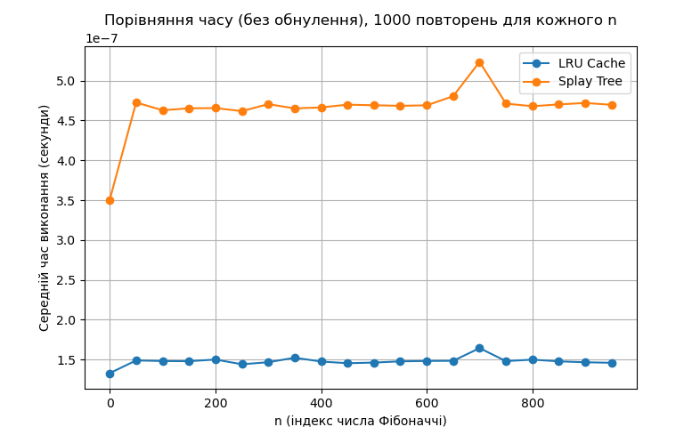

## Завдання 1

Щоб побачити відчутний виграш від кешу, у коді використано штучно вигідний сценарій:
- **45 000** раз викликається `Range` для **одного й того ж** відрізка (після першого обчислення наступні 44 999 запитів отримують суму з кешу миттєво).
- **5 000** викликів `Update` відбуваються далеко за межами цього відрізка, тому кешовані дані не інвалідовуються.

**Час виконання без кешування:** 3.33 секунд  
**Час виконання з LRU-кешем:** 0.03 секунд

---

## Завдання 2

**Аналіз:**  
- LRU-кеш у Python виявився ефективнішим для обчислення чисел Фібоначчі на великих *n*.  
- Splay Tree теж повторно використовує проміжні значення, проте вартість операцій переструктурування дерева (сплайювання) є більшою за накладні витрати вбудованого кешу Python.

